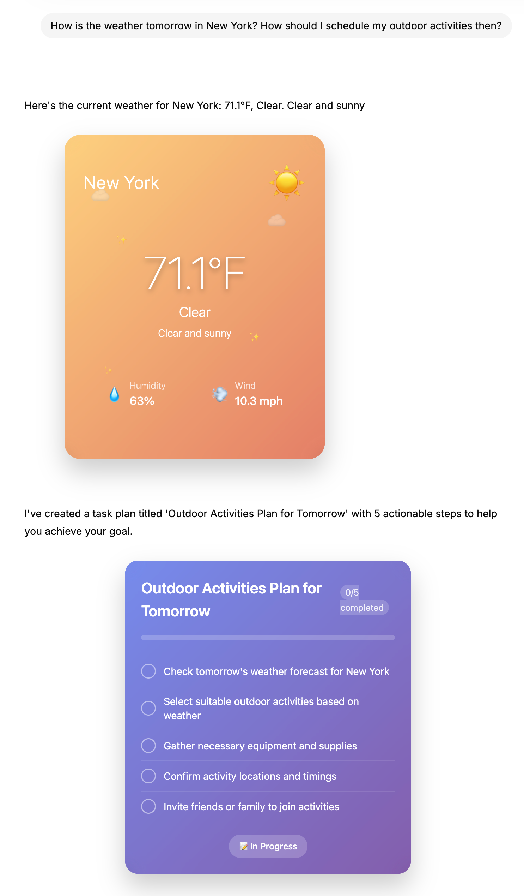

# Generative UI with LangGraph

[](https://github.com/langchain-ai/new-langgraph-project/actions/workflows/unit-tests.yml)
[](https://github.com/langchain-ai/new-langgraph-project/actions/workflows/integration-tests.yml)

A sophisticated multi-agent system built with [LangGraph](https://github.com/langchain-ai/langgraph) that demonstrates advanced **Generative UI** capabilities. The system intelligently routes between multiple specialized handlers including weather queries, task planning, and video editing workflows, responding with both conversational text and rich, interactive UI components.

<div align="center">
  
</div>

<div align="center">
  
</div>

## Features

🌤️ **Real Weather Data** - Integrates with WeatherAPI for live weather information with intelligent city detection  
📝 **AI-Powered Task Planning** - Uses OpenAI to generate detailed step-by-step plans from user requests  
🎬 **Video Editing Workflows** - Specialized dual-column task management for video editing projects  
🎨 **Advanced Generative UI** - Backend dynamically commands frontend to render specialized components  
✨ **Rich Interactive Components** - Modern TypeScript React components with animations and progress tracking  
🧠 **Intelligent Multi-Agent Routing** - LLM-powered routing between weather, todo, and video editing handlers  
🌍 **Multi-language Support** - Automatic language detection with responses in English, Chinese, and Japanese  
🏗️ **Modular Architecture** - Component-based handlers with extensible registry system  
🔄 **Hot Reload Development** - Real-time updates during development with LangGraph Studio  
🧪 **Comprehensive Testing** - Unit and integration tests with CI/CD workflows

## How It Works

### Weather Queries
1. **User Input**: "What's the weather in London?"
2. **Intelligent Routing**: LLM analyzes request and routes to weather handler
3. **City Detection**: OpenAI-powered extraction of city from natural language
4. **Live Data Fetch**: Integrates with WeatherAPI for real-time weather information
5. **Dual Response**: 
   - Conversational AI message: "Here's the current weather for London"
   - UI Component: Renders animated weather card with live data
6. **Rich Display**: Interactive weather card with temperature, conditions, humidity, and wind speed

### Task Planning
1. **User Input**: "Help me plan a birthday party"
2. **Intelligent Routing**: LLM identifies task planning intent and routes to todo handler
3. **AI Task Generation**: OpenAI generates detailed, actionable task breakdown
4. **Dual Response**:
   - Conversational AI message: "I've created a task plan for: Birthday Party Planning"
   - UI Component: Renders interactive todo list with checkboxes
5. **Rich Display**: Animated todo card with progress tracking and completion badges

### Video Editing Workflows
1. **User Input**: "Help me edit a promotional video"
2. **Intelligent Routing**: LLM identifies video editing intent and routes to video editing handler
3. **Workflow Generation**: AI creates specialized subtraction and addition task lists
4. **Dual Response**:
   - Conversational AI message: "I've created a video editing plan with removal and addition tasks"
   - UI Component: Renders dual-column interface with separate task categories
5. **Rich Display**: Professional diff-like interface with separate progress tracking for each task type

### Supported Query Types

#### Weather Queries
- "What's the weather in London?"
- "Current temperature in Tokyo"
- "Weather forecast for New York"
- "Is it raining in San Francisco?"

#### Task Planning Queries
- "Create a checklist for moving to a new apartment"
- "Help me organize my work schedule"
- "Plan steps for learning a new programming language"
- "What tasks do I need for hosting a dinner party?"

#### Video Editing Queries
- "Help me edit a promotional video"
- "Video editing workflow for social media content"
- "Steps to create a product demo video"
- "Edit a wedding video with music and transitions"

#### Multi-language Support
- **English**: "What's the weather like?"
- **Chinese**: "今天天气怎么样？"
- **Japanese**: "今日の天気はどうですか？"

## Getting Started

<!--
Setup instruction auto-generated by `langgraph template lock`. DO NOT EDIT MANUALLY.
-->

<!--
End setup instructions
-->

1. Install dependencies, along with the [LangGraph CLI](https://langchain-ai.github.io/langgraph/concepts/langgraph_cli/), which will be used to run the server.

```bash
cd path/to/your/app
pip install -e . "langgraph-cli[inmem]"
```

2. Create a `.env` file and configure your API keys.

```bash
cp .env.example .env
```

**Required API Keys**: Add your API keys to enable full functionality:

```text
# .env
OPENAI_API_KEY=your_openai_api_key_here
WEATHER_API_KEY=your_weatherapi_key_here
```

**Optional**: If you want to enable LangSmith tracing, add your LangSmith API key:

```text
# .env
LANGSMITH_API_KEY=lsv2...
```

> **API Key Requirements**:
> - **OpenAI API Key**: Required for intelligent routing, task planning, and video editing workflows
> - **WeatherAPI Key**: Required for real-time weather data (get free key at [weatherapi.com](https://www.weatherapi.com/))
> - Without these keys, handlers will fall back to basic templates with mock data

3. Start the LangGraph Server.

```shell
langgraph dev
```

4. Open `https://agentchat.vercel.app/` in Chrome, and connect to local server.

<div align="center">
  
</div>

For more information on getting started with LangGraph Server, [see here](https://langchain-ai.github.io/langgraph/tutorials/langgraph-platform/local-server/).

## Architecture

### Core Components

- **`langgraph.json`** - Configuration hub connecting backend graph to frontend UI
- **`src/agent/graph.py`** - Multi-agent graph with intelligent routing and component handling
- **`src/agent/handlers/`** - Modular component handlers (weather, todo, video_editing)
- **`src/agent/components/`** - TypeScript React UI components with animations
- **`src/agent/utils/`** - Language detection and response formatting utilities
- **`tests/`** - Comprehensive unit and integration test suites

### Multi-Agent Generative UI Flow

```
User Query → Language Detection → LLM Routing → Handler Processing → Dual Response
    ↓              ↓                   ↓              ↓                ↓
"help edit    Auto-detect        Route to         Generate         AI Message +
 video"       language           VideoHandler     tasks            UI Component
                                      ↓                              ↓
                                 Subtraction/                VideoEditingComponent
                                 Addition Tasks              (Dual-column layout)
```

### Key Architecture Features

- **Modular Handlers**: Each component type has its own specialized handler
- **Component Registry**: Dynamic registration and discovery of handlers
- **Type Safety**: Full TypeScript support with component prop interfaces
- **Language Support**: Automatic detection and multi-language responses
- **Extensible Design**: Easy to add new handlers and UI components

## How to Customize

### Adding New Component Handlers

1. **Create Handler Class** in `src/agent/handlers/`:
```python
from .base import BaseComponentHandler

class MyCustomHandler(BaseComponentHandler):
    @property
    def component_type(self) -> str:
        return "myCustom"
    
    async def process_request(self, request: str, language: str = 'en') -> Dict[str, Any]:
        # Your custom logic here
        pass
```

2. **Register Handler** in `src/agent/handlers/registry.py`:
```python
from .my_custom import MyCustomHandler
component_registry.register_handler(MyCustomHandler())
```

3. **Create React Component** in `src/agent/components/`:
```typescript
interface MyCustomProps {
  // Define your props
}

const MyCustomComponent: React.FC<MyCustomProps> = (props) => {
  // Your component implementation
};
```

4. **Register Component** in `src/agent/components/index.ts`:
```typescript
import MyCustomComponent from './MyCustomComponent';

export default {
  // ... existing components
  myCustom: MyCustomComponent,
};
```

### Customizing Existing Handlers

- **Weather Handler**: Modify city detection, add new weather APIs, customize styling
- **Todo Handler**: Update task generation prompts, add categories, enhance UI
- **Video Editing Handler**: Add new task types, customize workflows, enhance progress tracking

### Advanced Customization

- **Multi-step Workflows**: Chain multiple handlers for complex tasks
- **Custom Language Support**: Add new languages to `src/agent/utils/language.py`
- **Real-time Features**: Implement WebSocket connections for live updates
- **User Context**: Add user preferences and personalization

## Development

While iterating on your graph in LangGraph Studio, you can edit past state and rerun your app from previous states to debug specific nodes. Local changes will be automatically applied via hot reload.

Follow-up requests extend the same thread. You can create an entirely new thread, clearing previous history, using the `+` button in the top right.

For more advanced features and examples, refer to the [LangGraph documentation](https://langchain-ai.github.io/langgraph/). These resources can help you adapt this template for your specific use case and build more sophisticated conversational agents.

LangGraph Studio also integrates with [LangSmith](https://smith.langchain.com/) for more in-depth tracing and collaboration with teammates, allowing you to analyze and optimize your chatbot's performance.

<!--
Configuration auto-generated by `langgraph template lock`. DO NOT EDIT MANUALLY.
{
  "config_schemas": {
    "agent": {
      "type": "object",
      "properties": {}
    }
  }
}
-->
